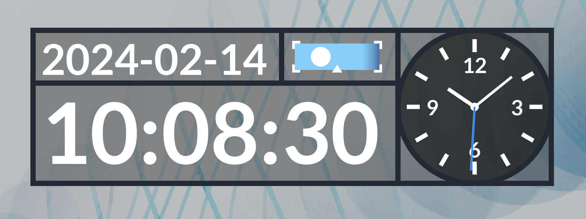

# 🐥麻雀时钟 / Sparrow Clock🕙

[English Introduction](#english-introduction)

可以在悬浮窗中显示的模块化时钟，可以一键置顶或置底，自由调整位置，自由安排显示内容，基于 [LÖVE 引擎](https://love2d.org/)制作。

鼠标移动到窗口中，或点击窗口，右上角会出现三个按钮，从左到右功能分别是「切换置顶/置底」「按住拖动窗口」「关闭」

主要特点有：
- 符合我的个人审美
  - 有数字时钟、指针时钟，还有日月钟，直观
  - 也可以自己改成符合你审美的样子，但主要是我自己用，所以没有详细的文档，也不保证兼容旧版本
- 占用电脑资源很少
  - 画面刷新和事件响应分离，一秒刷新画面次数很少（默认小于10帧），占用CPU和GPU均极少
- 支持半透明显示
  - 使用 `DwmEnableBlurBehindWindow` 等 Windows API 让 LÖVE 的绘制内容透明叠加到桌面上
  - 目前只支持 Windows 系统，没有移植到其他系统的计划，但 LÖVE 兼容多系统，只要对应系统（或窗口合成器）上可以使用 lua ffi 调用 API 实现类似的效果，就可以移植。即使无法实现透明窗口，至少也可以在 LÖVE 支持的平台上运行
- 可以用 Lua 自己编写模块

## 配置

配置文件为 `user_external.lua` ，请参考源码中的 `user.lua`，因为主要是自己用，目前没有文档。

窗口位置不会保存，可以在配置文件里面修改

命令行参数 `debug` 可以启用调试模式，按下一些字母键可以调整时间、改变时间流速。按 `/` 可以切换调试网格和边框显示不显示。

如果要自己编写模块，可以参考现有的模块，编写 `<模块名>.lua` 放到程序目录下的 `modules` 目录中，然后在配置文件中使用。

## 构建

构建脚本为 `build.sh`，使用 bash 运行
在 Windows 下，推荐使用 [MSYS2](https://www.msys2.org/) bash 环境，或者 Git Bash，或者 WSL，反正构建脚本也很简单。

构建会在 `build` 目录下生成 Windows 系统的可执行文件和依赖。

构建需要设置环境变量：

- `VERSION`: 版本
- `LOVE_DIR`: LÖVE 主程序所在的目录
- `IMAGEMAGICK`: ImageMagick 主程序(magisk)路径，生成 ico 图标
- `RESOURCEHACKER`: resource hacker 主程序路径，给程序替换图标

## 许可协议

本项目按照 MIT 协议发布，具体请看 LICENSE.txt

本项目包括的依赖相关信息：

- LuaDate v2.2
  - 项目主页：<https://github.com/Tieske/date>
  - 作者：\
    Copyright © 2005-2006 Jas Latrix <jastejada@yahoo.com>\
    Copyright © 2013-2021 Thijs Schreijer
  - 协议：[MIT 协议](https://opensource.org/license/mit/)
- inspect.lua
  - 项目主页：<https://github.com/kikito/inspect.lua>
  - 作者：[Enrique García Cota (kikito)](https://github.com/kikito)
  - 协议：MIT 协议
- profile.lua
  - 项目主页：<https://github.com/2dengine/profile.lua>
  - 作者：[2dengine LLC](https://github.com/2dengine)
  - 协议：MIT 协议

## English Introduction

Modular clock within a floating window for effortless time-telling on your screen. Based on LÖVE and can be customized for your own need.

(No more because I'm tired to translate it myself when writing this. Please use your favourite translator.)
